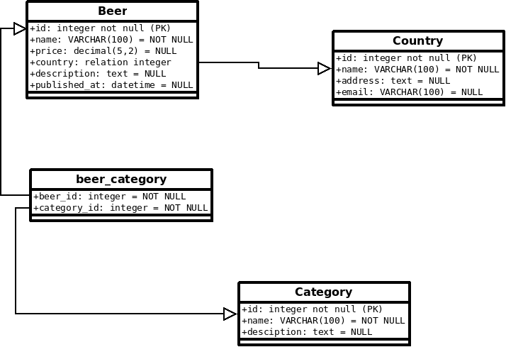

# TP binôme de 2 à 3

## Exercice bières et catégories

1. Créez la catégorie blonde et assoiez cette catégorie à vos bière déjà créées.

2. Créez une bière Ardèche et associez cette bière à des catégories, pensez à créer quelques catégories au préalable.

## Exercice Fixtures Doctrine, insertion de données dans les tables

Nous allons maintenant utiliser des fixtures pour insérer des données d'exemple dans la ressource Beer en base de données, en ligne de commande tapez :

```bash
composer require --dev doctrine/doctrine-fixtures-bundle
```

Vous devriez maintenant avoir dans le dossier src le dossier **DataFixtures** ainsi qu'une classe **AppFixtures**. C'est cette dernière classe qui va nous permettre d'insérer des données automatiquement en base de données.

Installez également **Faker** pour le développement c'est un component permettant d'insérer des données d'exemple. Il permet d'avoir des patterns d'exemple comme des numéros de téléphone, adresse, nom, texte, ...

Vous trouverez la documentation officiel à l'adresse suivante :
[https://github.com/fzaninotto/Faker](https://github.com/fzaninotto/Faker)

```bash
composer require --dev fzaninotto/faker
```

Dans le fichier AppFixtures.php précisez le namespace de la dépendance Faker comme suit (autoloader), précisez également le nom des entités avec lesquelles vous souhaitez travailler :

```php

<?php

namespace App\DataFixtures;

use Faker;
use App\Entity\Beer;

use Doctrine\Bundle\FixturesBundle\Fixture;
use Doctrine\Common\Persistence\ObjectManager;

class AppFixtures extends Fixture
{
    public function load(ObjectManager $manager)
    {
        $faker = Faker\Factory::create('fr_FR');
        // ICI vous devez coder l'insertion des données
        // avec les patterns Faker
    }
}

```

Pour gérer plusieurs fixtures pour vos données, vous pouvez utiliser la syntaxe suivante :

```php

namespace App\DataFixtures;

// ...
class CountryFixtures extends Fixture
{
    public function load(ObjectManager $manager)
    {
        // ...
    }
}

// src/DataFixtures/GroupFixtures.php
namespace App\DataFixtures;
// ...

use Doctrine\Common\DataFixtures\DependentFixtureInterface;

class BeerFixtures extends Fixture implements DependentFixtureInterface
{
    public function load(ObjectManager $manager)
    {
        // ...
    }

    public function getDependencies()
    {
        return [
            CountryFixtures::class,
        ];
    }
}
```

## Exercice Faker et AppFixtures

Insérez 20 bières à l'aide de AppFixture et de Faker, puis tapez la ligne de commande suivante pour les insérer en base de données

```bash
php bin/console doctrine:fixtures:load
```

Indication, vous pouvez créer des données personnelles (noms de bière) puis utilisez Faker pour donner une description de chacune de vos bière.

Pour plus d'information sur ces commandes reportez-vous à la documentation officiel :
[Fixture](https://symfony.com/doc/master/bundles/DoctrineFixturesBundle/index.html)


```php

$repository = $this->getDoctrine()->getRepository(Beer::class);
$beers = $repository->findAll();

```

Affichez maintenant les bières sur la page beer. Notez que la syntaxe dans le template Twig pour afficher les données est différentes du PHP habituel. Utilisez l'affichage HTML/CSS que l'on a déjà mis en place sur cette page.

```html


    {{ beer.name }}
    {# attention la date est retournée dans un objet
    il faut donc appliquer un pipe | et une fonction
    dessus pour afficher la date correctement :
     #}
    {{ beer.publishedAt | date('d/m/Y')}}


```

## Exercice Ajoutez un champ price et un champ degree

Reprenez l'entité Beer et ajouter un price et degree à celle-ci. Pour se faire il suffit de relancer la commande suivante, notez que pour un décimale vous préciserez que ce dernier est sur 5 chiffres significatifs avec 2 chiffres après la virgule pour price et degree.

Attention le degree est un champ obligatoire, le prix est facultatif.

```bash

# Ajoutez le nouveau champ ...
php bin/console make:entity

# Créez le fichier de migration en tenant compte de
# l'état de la base de données et des entités => elle se connecte à la base de données
# et étudie la différence
php bin/console doctrine:migrations:diff

# pensez à faire la commande pour modifier la base de données
```

Mettez à jour les fixtures en ajoutant à l'aide de faker des prix et des degrées à vos bières.



## Exercice Client

Vous allez maintenant mettre des données dans la table client.

## Exercice page d'accueil

Affichez les trois dernières bières sur la page d'accueil.

## Exercice afficher les données des bières

Améliorez l'affichage de la page des bières. Affichez une image de bière différente par bière et affichez les informations de chaque bière sur la page d'accueil.

Chaque bière sera cliquable et vous afficherez le détails d'une bière. Pensez également à afficher les informations de la bière.


- Dans le template Twig vous utiliserez la syntaxe suivante pour créer un lien vers la page d'une bière

```php
<a href="{{ path('show_beer', { 'id' : beer.id }) }}">
{{ beer.name }}
/a>

```

Dans le contrôleur vous récupérerez l'id d'une bière comme suit :

```php
public function showBeer(int $id)
{
}
```

## Exercice page des clients (facultatif)

Créez un lient vers la page des clients, affichez les informations qui sont en relation avec ces derniers.


```text
    Home Beers [Clients]

    information relative aux clients
```